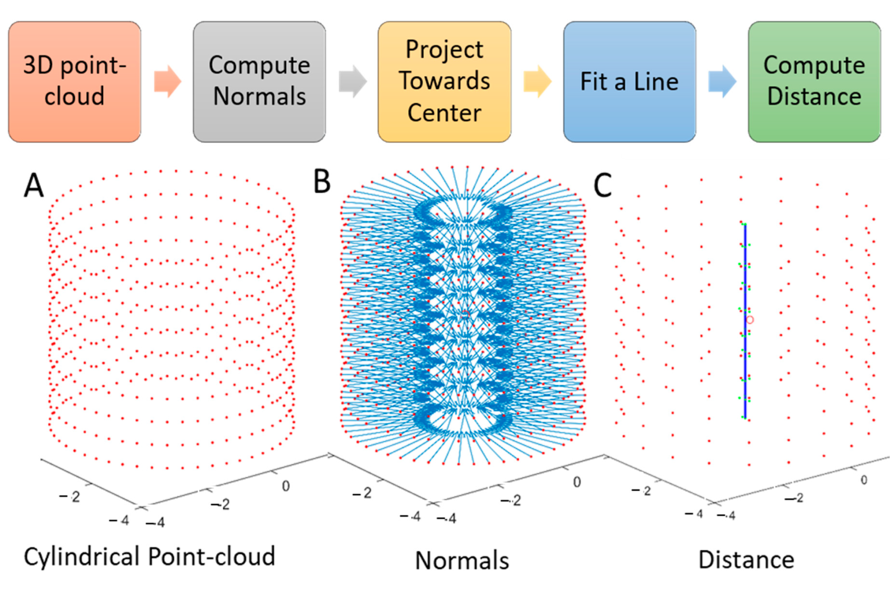
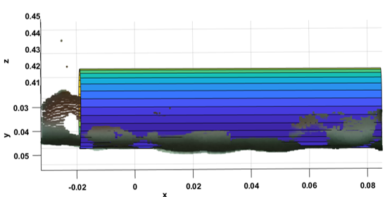
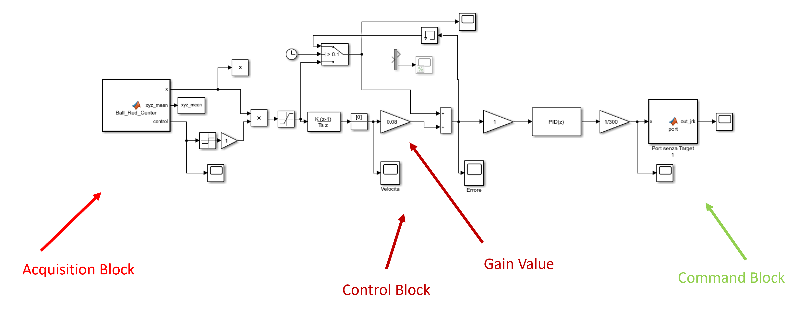
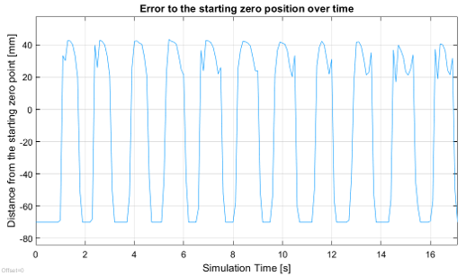
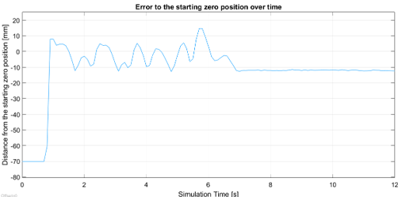
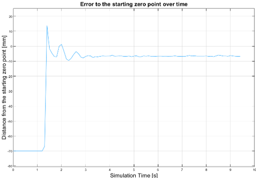
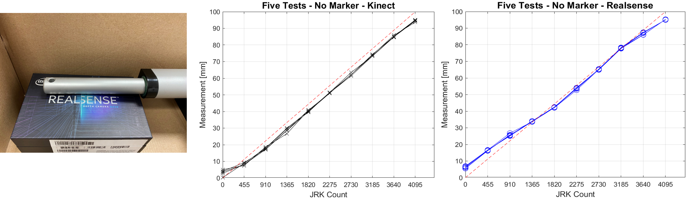
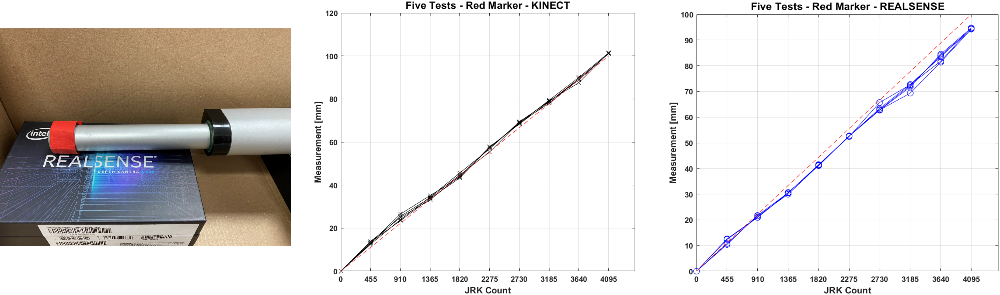
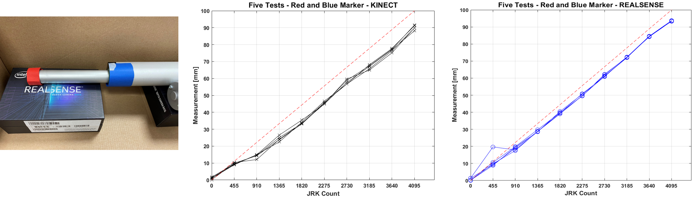

# 🧠 RGB-D Camera Controlled Linear Actuator

This project demonstrates how to use an RGB-D camera to measure and control the position of a linear actuator in a completely contactless fashion. The actuator is controlled in closed-loop using only computer vision feedback. The approach leverages both color segmentation and point-cloud geometry to track motion and enable basic mechanical system control.

---

## 🌟 Key Goals

- Measure actuator displacement using **depth cameras** (no encoders or potentiometers)
- Implement **vision-based control** for:
  - Reaching a visual target ("Hit Red")
  - Stabilizing a ball on a moving slide ("Ball Control")

---

## ⚙️ Hardware Setup

| Component                    | Description                                      |
|-----------------------------|--------------------------------------------------|
| **Intel® RealSense D435**   | RGB-D camera (active stereo, 1280x720 @90 fps)   |
| **Microsoft Kinect V2**     | RGB-D camera (structured light, 512x424 @30 fps) |
| **Pololu LACT4P-12V-05**    | Linear actuator (10 cm stroke, 150 N)           |
| **Pololu JRK 21v3**         | USB motor controller (with/without feedback)     |

<p align="center">
  
  
</p>
<p align="center"><em>Left: test bench without slide. Right: test bench with ball control setup.</em></p>


---

## 🛠️ Software Stack

- **Vision processing**: depth stream acquisition, segmentation, and point-cloud geometry
- **Control loop**: implemented in MATLAB/Simulink for closed-loop actuation

---

## 🔍 Measurement Techniques

### 1. Marker-Based
- Color segmentation to detect red or blue markers
- Compute Euclidean distance from initial reference or between two markers

<p align="center">
  
</p>
<p align="center"><em>Examples of red marker, red+blue marker, and no marker (markerless) setups.</em></p>

### 2. Markerless (Best Performance)
A cylinder fitting algorithm is applied to the 3D point cloud representing the actuator shaft:

#### Algorithm Steps:
1. **Acquire** 3D point cloud of the actuator
2. **Compute** surface normals and flip them toward the cylinder axis
3. **Project** points along normals toward axis
4. **Fit a line** to projected points (least squares)
5. **Measure** actuator stroke as distance between two farthest points on the axis

<p align="center">
  
</p>
<p align="center"><em>Steps of the plane-fitting algorithm for cylinder detection and measurement.</em></p>

<p align="center">
  
</p>
<p align="center"><em>Visual output of the fitted cylinder from the point cloud.</em></p>

**Performance:**
- Avg. error: **2.83 mm**, Std. dev.: **0.35 mm** over 5 repetitions

---

## 🎮 Control Applications

### 🔴 Target Tracking ("Hit Red")
- Detect red marker or object
- Compute 3D position via RGB-D
- Closed-loop control via Simulink

<p align="center">
  
  </img>
</p>
<p align="center"><em>Closed-loop control test to chase a red target using vision feedback.</em></p>

### ⚖️ Ball Stabilization ("Ball Control")
- Detect red ball via color + geometry
- Control actuator to hold it still at desired point
- Gain tuning: `Kp = 150`, `Ki = 2`, attenuation: `0.1 → 0.09 → 0.08`

<p align="center">
  
</p>
<p align="center"><em>Simulink control architecture for the ball stabilization task.</em></p>

<p align="center">
  
  
</p>
<p align="center"><em>Stabilization error to the reference over time for different controller setups.</em></p>

<p align="center">
  
</p>
<p align="center"><em>Smoothed response using additional attenuation.</em></p>

🎥 Additional video demos:
- `docs/zero_point_attenuation_008_pi_150_2.MOV`
- `docs/zero_point_attenuation_pi_150_2.mp4`
- `docs/zero_point_pi_150_2.MOV`

---

## 📊 Test Results Summary

| Test Type           | Kinect                   | RealSense                |
|---------------------|--------------------------|--------------------------|
| No Marker           | `img/no_marker_compare.png`  | `img/no_marker_compare.png`  |
| Red Marker          | `img/one_marker_compare.png` | `img/one_marker_compare.png` |
| Red + Blue Markers  | `img/two_marker_compare.png` | `img/two_marker_compare.png` |

<p align="center">
  
  
</p>
<p align="center"><em>Comparison between JRK and vision-based measurements for markerless and one-marker methods.</em></p>

<p align="center">
  
</p>
<p align="center"><em>Measurement repeatability using two markers.</em></p>

---

## 📂 Repository Structure

```
RGBD-camera-control/
├── Linear Actuator control by RGBD Camera/
│   ├── src/                   # Code (MATLAB/Python)
│   ├── docs/                  # Diagrams, images, videos
│   └── README.md              # Project description
```

---

## 🧠 Citation
If you use this work, cite:

```
@article{nicolella_rgbd_2021,
  title={Mechanical System Control by RGB-D Device},
  author={Cosenza, Chiara and Nicolella, Armando and Esposito, Daniele and Niola, Vincenzo and Savino, Sergio},
  journal={Machines},
  volume={9},
  number={1},
  pages={3},
  year={2021},
  publisher={MDPI},
  doi={10.3390/machines9010003}
}
```

---

👨‍💻 Developed as part of Armando Nicolella's MSc Thesis @ Università degli Studi di Napoli Federico II

