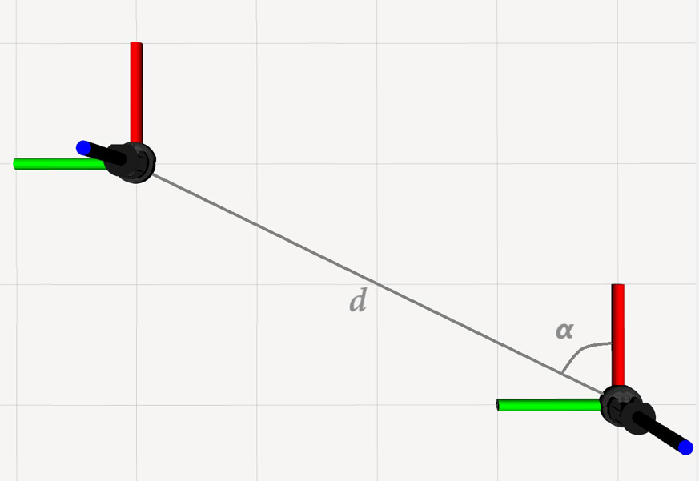
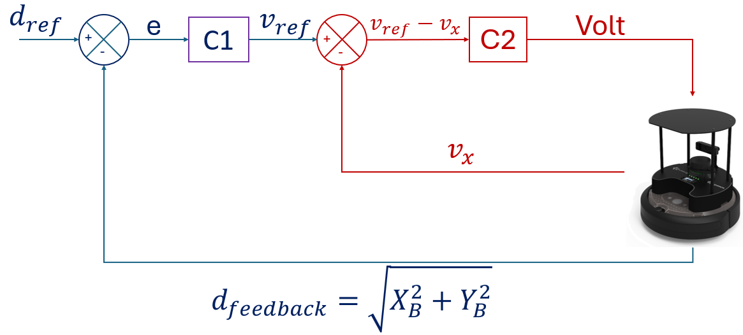

# 👨‍💻 ArUco-Based Leader–Follower Navigation with TurtleBot 4

## 📚 Overview
This project implements a **leader–follower navigation strategy** for mobile robots using **ROS 2** and **TurtleBot 4** platforms.  
A **leader robot** is tracked by a **follower robot** through **visual detection** of an **ArUco marker** mounted on the leader, using an onboard **Intel RealSense D435i RGB-D camera**.  
The system supports both **real-world experiments** and **Ignition Gazebo simulations**, including **dynamic obstacle avoidance** and **collaborative navigation**.

## 🎯 Project Goals
- Develop a **robust leader–follower strategy** using vision-based pose estimation.
- Validate the system both **in simulation** and **in real-world testing**.
- Implement **cooperative obstacle avoidance** strategies between leader and follower.
- Evaluate performance through **tracking accuracy**, **network latency**, and **controller comparisons** (PID vs SMC).

  

<em>Reference frames of the leader and follower robots, with the controlled distance <strong>d</strong> and angle <strong>α</strong>.</em>

## ✨ Key Features
- **Leader–Follower System** based on ArUco visual tracking.
- **Multi-Level Testing** including dynamic following, motion law emulation, and obstacle avoidance.
- **Dual Control Strategies**: PID and SMC.
- **Real-world Experiments** and **Ignition Gazebo Simulations**.
- **Collaborative Obstacle Avoidance**.
- **Full ROS 2 Integration** leveraging DDS communication.

## 🛠️ Technologies Used
- TurtleBot 4 (iRobot Create 3 + Raspberry Pi 4)
- Intel RealSense D435i (RGB-D Camera)
- RPLIDAR A1M8 (2D LiDAR)
- ROS 2 Humble
- OpenCV (for ArUco detection and pose estimation)
- Ignition Gazebo (for simulation)
- RViz2 (for visualization)

## 🧪 Experimental Validation

  

<em>Feedback control scheme regulating the follower's velocity based on the measured distance error.</em>

### 📍 Chasing Test Results
| Metric        | Gazebo Simulation | Real-World Testing |
|---------------|-------------------|--------------------|
| MAE (m)       | 0.026              | 0.031              |
| MAPE (%)      | 7.88               | 9.92               |
| RMSE (m)      | 0.031              | 0.037              |
| Std Deviation (m) | 0.025          | 0.032              |

  

<em>Animation showing the leader–follower behavior during the Chasing Test.</em>

  

<em>Trajectory tracking of the leader and follower robots during the Chasing Test.</em>

---

### 📍 Law of Motion Test Results (PID Control)
| Metric        | Gazebo Simulation | Real-World Testing |
|---------------|-------------------|--------------------|
| MAE (m/s)     | 0.013              | 0.014              |
| MAPE (%)      | 6.18               | 7.25               |
| RMSE (m/s)    | 0.016              | 0.017              |
| Std Deviation (m/s) | 0.012         | 0.013              |

### 📍 Law of Motion Test Results (SMC Control)
| Metric        | Real-World Testing |
|---------------|--------------------|
| MAE (m/s)     | 0.007              |
| MAPE (%)      | 3.46               |
| RMSE (m/s)    | 0.009              |
| Std Deviation (m/s) | 0.006         |

  

<em>Velocity tracking of the leader and follower robots using Sliding Mode Control (SMC) during the Law of Motion Test.</em>

### 📍 PID vs SMC Comparison
| Controller | MAE (m/s) | RMSE (m/s) | Notes |
|------------|-----------|------------|-------|
| PID        | 0.014     | 0.017      | Higher oscillations |
| SMC        | 0.007     | 0.009      | Smoother tracking and better robustness |

---

### 📍 Obstacle Avoidance Test Results
| Metric        | Real-World Testing |
|---------------|--------------------|
| MAE (m)       | 0.022              |
| RMSE (m)      | 0.028              |
| Std Deviation (m) | 0.021          |

  

<em>Animation showing the collaborative obstacle avoidance behavior between leader and follower robots.</em>

  

<em>Trajectory of the leader and follower robots during the Obstacle Avoidance Test with dynamic obstacle detection.</em>

---

---

## 📂 Repository Structure
This repository includes:
- Simulation launch files.
- Real-world launch files.
- ROS 2 nodes for:
  - ArUco detection
  - Leader-follower control (PID and SMC)
  - Obstacle avoidance
- Experimentation results and validation scripts.

> *(Detailed README files for each subfolder and module will be provided separately.)*

## 🙏 Acknowledgments
This project was developed at the **University of Naples Federico II**, Department of Industrial Engineering, within the activities of the **LAM4r Laboratory**.  
The research, design, and development activities were carried out by the laboratory team.  
Special thanks to **Pasquale Stingo**, who contributed by performing the experimental tests during his Master's thesis project.
