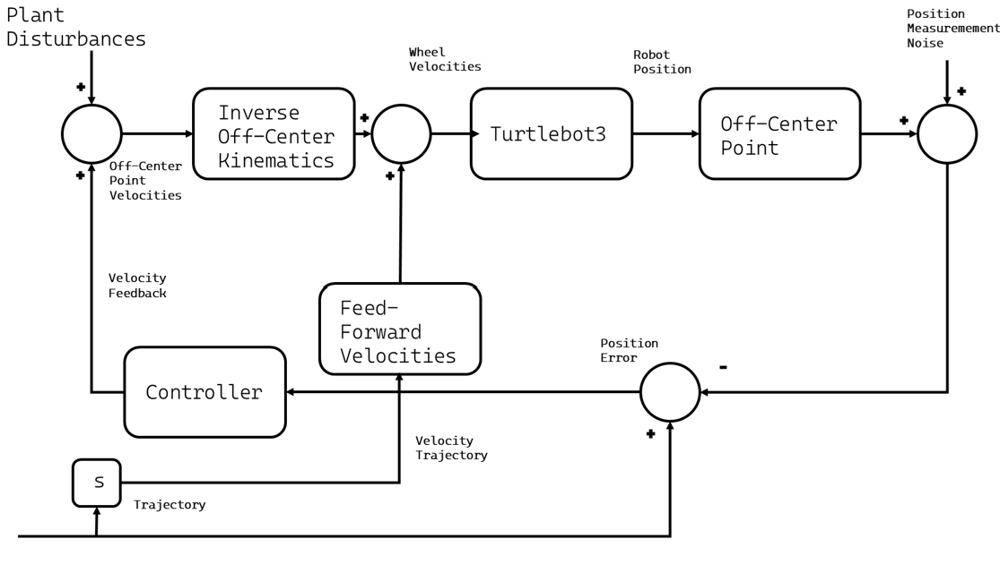
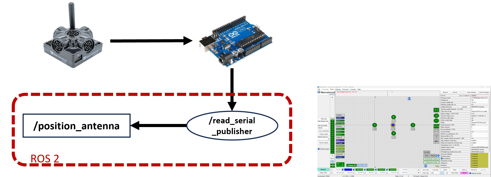

# H-infinity Control for Robust Trajectory Tracking

## 🔧 Motivation

Trajectory tracking is a fundamental requirement for autonomous mobile robots operating in uncertain and dynamic environments.  
Classical control methods, while effective under ideal conditions, often fail to deliver reliable performance when faced with disturbances, sensor noise, or unmodeled dynamics.

To overcome these challenges, this repository implements an **H∞ control strategy** that enhances robustness and ensures high-precision tracking even under adverse conditions.

## 🧠 Control Strategy Overview

The control architecture is based on two key components:

- **Feedforward Control**: Generates the desired trajectory assuming no disturbances.  
- **Feedback Control**: Reacts to external disturbances and model inaccuracies to minimize trajectory errors.

The H∞ controller is designed to **minimize the worst-case amplification** of disturbances.  
This is achieved through an optimization process based on **Linear Matrix Inequalities (LMIs)**, ensuring both stability and performance.

  

<em>Block diagram of the control system, including inverse kinematics, feedforward and feedback components.</em>

## 🧪 Experimental Validation

The proposed controller has been validated on a **TurtleBot3 Waffle Pi** using **ROS 2**.  
Experiments involved tracking a figure-eight (∞) trajectory in an indoor environment with sensor noise and external disturbances.

  

<em>Localization framework and example of the real-world testbed.</em>

The localization system is based on the Marvelmind Indoor "GPS" beacons, connected via an Arduino board to ROS 2.  
The setup includes serial communication publishing position data as ROS topics.

  

<em>Localization system architecture using Marvelmind and ROS 2.</em>

