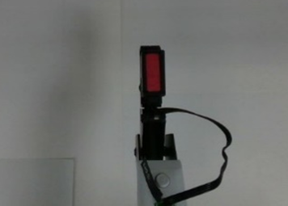
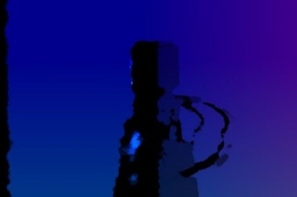
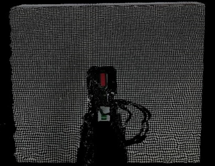
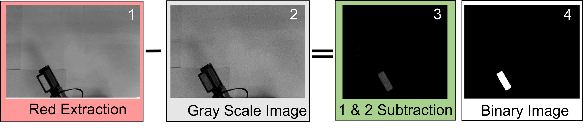
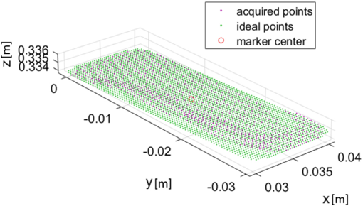
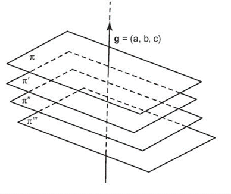
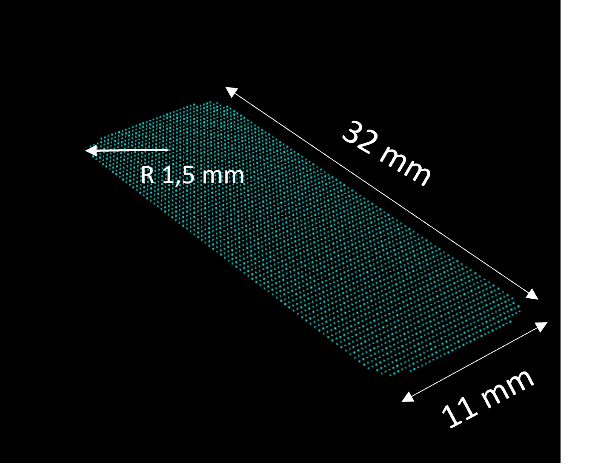
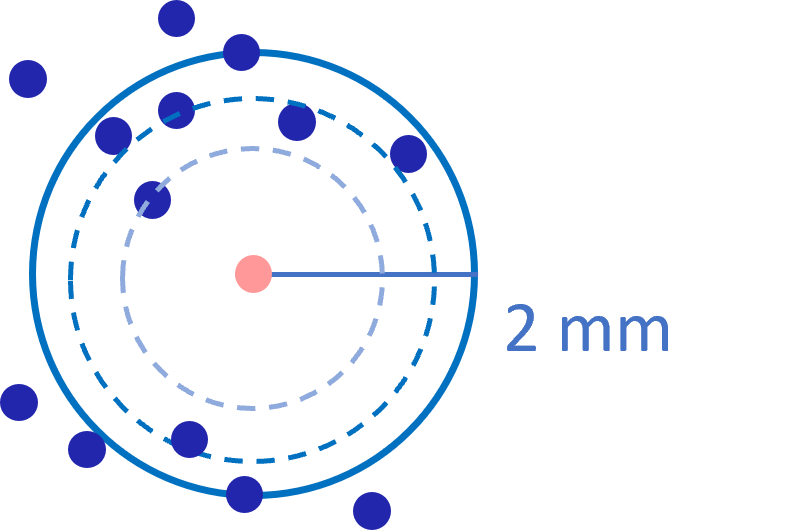
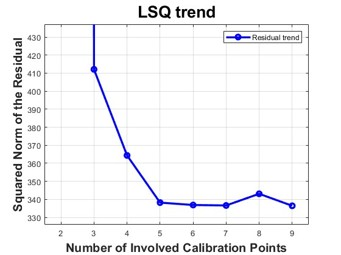

# 🎯 Hand–Eye Calibration for Mobile Robot Manipulation

This module presents a MATLAB-based implementation of a **marker-based hand–eye calibration** pipeline between an external camera and its end-effector, fundamental for **Position-Based Visual Servoing (PBVS)**. The system is designed to work with **unstructured fiducial markers** (such as custom patterns), offering flexibility across different platforms and camera models.

---

## 🧠 Project Overview
The pipeline is designed for a **mobile robotic platform** equipped with a fixed onboard RGB-D camera. However, all current **experiments were performed off-board**, without an actual mobile base. The camera is positioned to capture both the **end-effector** and a portion of the **surrounding environment**, ensuring spatial observability for hand–eye calibration.

- **Objective:** Estimate the transformation matrix `X` in the equation `AX = XB`
- **Setup:**  
  - Mobile base with fixed onboard camera for perception.
  - Robotic arm or mock end-effector  
  - Fiducial markers for reference frame estimation
- **Implementation:** Developed in **MATLAB**, using rigid body transformations and vision-based pose estimation  
- **Marker:** Non-structured — supports custom patterns if implemented with segmentation  
- **Use case:** Moving object in the robot workspace


## 🖼️ System Architecture

<p align="center">
  
</p>

<p align="center">
  <sub><sup>
    Frame graph showing the reference transformations between:  
    base frame {0}, end-effector {E}, gripper {G}, marker, and camera {C}.  
    Calibration aims to resolve the unknown transformation between \({C}\) and \({0}\) through pose estimation.
    <br><br>
    <em>Diagram adapted from:</em>  
    Peter Corke, <em>Robotics, Vision and Control: Fundamental Algorithms in MATLAB®</em>, Springer, 2011.  
    © Springer-Verlag London Limited 2011. All rights reserved.
  </sup></sub>
</p>


## 📐 Transformation Composition
<p align="center">  </p> <p align="center"> 
  <sub><sup> Graph showing the composition of transformations between reference frame (r), marker frame (M), and camera frame (c). The goal of the calibration is to estimate the unknown transformation rTc from the camera frame to the reference. 
  </sup></sub> 
</p>

## 📷 Experimental Setup – Frame Placement
<p align="center">
  
</p>

<p align="center">
  <sub><sup>
    Physical configuration of the hand–eye calibration setup.  
    The RGB-D camera (Intel Realsense D415) is mounted in a fixed overhead position and captures both the  
    **end-effector** of the Dobot Magician and part of the **workspace**.  
    Both camera and robot coordinate frames are visualized for reference.
  </sup></sub>
</p>

## 🧠 Calibration Pipeline

The following sequence illustrates the key steps in the custom hand–eye calibration process using a non-structured marker and RGB-D sensing:
1. **Data Acquisition** – Point clouds captured from multiple robot arm configurations  
2. **Color Segmentation** – Marker points isolated based on RGB filtering  
3. **Plane Fitting** – Best-fit plane estimation to reduce noise effects  
4. **Projection and Registration** – ICP-based alignment of point clouds  
5. **Optimization and Matrix Computation** – Transformation **rTc** computed from aggregated correspondences


### 🎥 Calibration Pose Sampling

The animation below shows the Dobot arm moving through a set of predefined configurations while marker points are tracked in the camera frame.

<p align="center">
  
</p>

<p align="center">
  <sub><sup>
    Sample sequence from calibration procedure — the marker is observed in multiple robot poses to estimate the transformation.
  </sup></sub>
</p>


## 📸 Data Acquisition – Sensor Output Views

Below are the different outputs captured by the Intel Realsense D415 during the calibration routine:

<p align="center">
  
  &nbsp;&nbsp;&nbsp;
  
  &nbsp;&nbsp;&nbsp;
  
</p>

<p align="center">
  <sub><sup>
    <strong>Left:</strong> Raw RGB image – <strong>Center:</strong> Depth map – <strong>Right:</strong> Point cloud generated from RGB-D stream.
  </sup></sub>
</p>

## 🎨 Color Segmentation Process

The red marker is isolated through a 4-step process based on RGB channel manipulation:

1. **Red Extraction** – isolate the red channel from the RGB image  
2. **Grayscale Conversion** – convert the RGB image to grayscale  
3. **Subtraction** – subtract grayscale from red layer to enhance contrast  
4. **Binarization** – apply a threshold to detect the red marker

<p align="center">
  
</p>

<p align="center">
  <sub><sup>
    Step-by-step segmentation of the red marker: input images are processed and binarized  
    to extract the invariant calibrator used in the transformation estimation.
  </sup></sub>
</p>


## 🧩 Plane Fitting

Due to noise and the limitations of RGB-D sensors, the extracted 3D points may not lie on a perfect plane.  
A **best-fit plane** is computed to correct misalignments and improve the marker center estimation.

<p align="center">
  
</p>

<p align="center">
  <sub><sup>
    Comparison of <strong>acquired</strong> 3D points (purple) and <strong>ideal</strong> fitted plane (green).  
    The red circle indicates the <strong>estimated marker center</strong> used for registration.
  </sup></sub>
</p>


## 📐 Projection and Registration

To improve registration, the extracted marker points are projected onto an artificial plane aligned with the estimated marker normal.  
This projection helps reduce the influence of noise before running the ICP alignment routine.

<p align="center">
  
  &nbsp;&nbsp;&nbsp;
  
</p>

<p align="center">
  <sub><sup>
    <strong>Left:</strong> Ground‑parallel planes used for normal estimation • 
    <strong>Right:</strong> Artificial planar target (32 × 11 mm) with dot radius 1.5 mm, used for ICP registration.
  </sup></sub>
</p>


## 🧠 Optimization and Matrix Computation

The final transformation rTc is estimated using a **nonlinear least-squares solver**, which minimizes the residuals between the registered points in the robot frame and those in the camera frame.

The estimated marker center lies within a 2 mm radius from the ideal location in most trials:

<p align="center">
  
</p>

<p align="center">
  <sub><sup>
    Blue dots: estimated positions across trials • Red dot: reference • Dashed rings: tolerance zones.
  </sup></sub>
</p>

Below is the trend of the squared residual norm as a function of the number of calibration poses:

<p align="center">
  
</p>

<p align="center">
  <sub><sup>
    Residual error stabilizes after ~6 calibration samples.
  </sup></sub>
</p>


## 🧰 Tools & Components

| Component            | Tool / Device                          |
|----------------------|----------------------------------------|
| RGB-D Camera         | Intel Realsense D415                   |
| Manipulator          | Dobot Magician                         |
| Marker type          | Custom planar marker (non-structured)  |
| Camera interface     | MATLAB                        |
| Marker detection     | Custom detection (no ArUco required)   |
| Calibration Optimization solver   | Least Squares  |
| Toolbox              | MATLAB Computer Vision Toolbox         |         


## 🛠️ Development Status
> ⚠️ This module is currently under **active development**.  <br>
> Code is being validated and optimized; full open-source release is not yet available.  <br>
> For academic collaboration or review purposes, access may be granted upon request. <br>
> Source code for the calibration routines will be added to this repository shortly. <br>


---


## 📄 Copyright & Acknowledgments

Special thanks to **Prof. Chiara Cosenza** and **Prof. Sergio Savino** for their guidance and supervision throughout the development of this project.

🧪 This work is based on the methodology described in the following publication:

> **Cosenza, C., Malfi, P., Nicolella, A., Niola, V., Savino, S.**  
> *Hand-Eye Calibration Using Invariant Calibrator Placed to a Robotic Arm*.  
> In: Quaglia G., Boschetti G., Carbone G. (eds) Advances in Italian Mechanism Science.  
> Mechanisms and Machine Science, vol 141. Springer, Cham. 2024.  
> [https://doi.org/10.1007/978-3-031-64553-2_40](https://doi.org/10.1007/978-3-031-64553-2_40)

📚 **BibTeX citation:**

```bibtex
@InProceedings{10.1007/978-3-031-64553-2_40,
  author    = {Cosenza, Chiara and Malfi, Pierangelo and Nicolella, Armando and Niola, Vincenzo and Savino, Sergio},
  editor    = {Quaglia, Giuseppe and Boschetti, Giovanni and Carbone, Giuseppe},
  title     = {Hand-Eye Calibration Using Invariant Calibrator Placed to a Robotic Arm},
  booktitle = {Advances in Italian Mechanism Science},
  year      = {2024},
  publisher = {Springer Nature Switzerland},
  address   = {Cham},
  pages     = {343--350},
  isbn      = {978-3-031-64553-2},
  doi       = {10.1007/978-3-031-64553-2_40}
}

