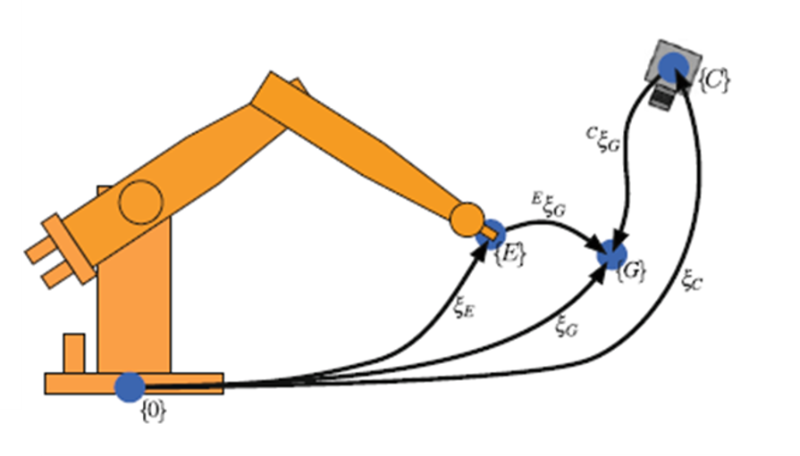
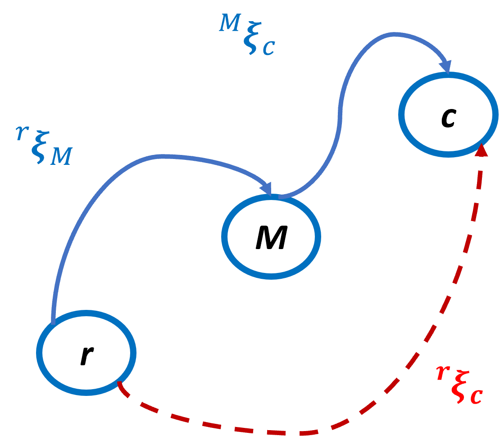
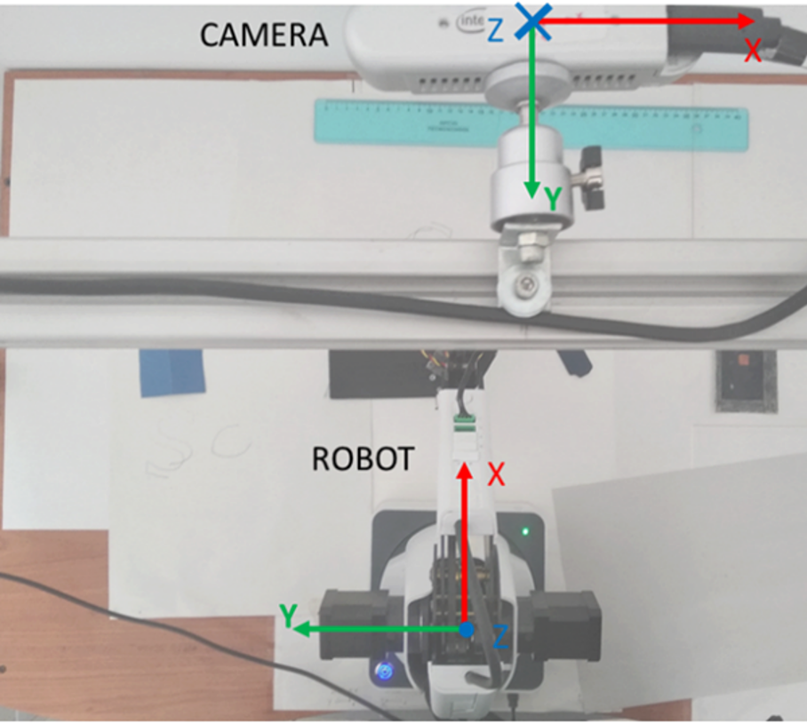

# 🎯 Hand–Eye Calibration for Mobile Robot Manipulation

This module presents a MATLAB-based implementation of a **marker-based hand–eye calibration** pipeline between an external camera and its end-effector, fundamental for **Position-Based Visual Servoing (PBVS)**. The system is designed to work with **unstructured fiducial markers** (such as custom patterns), offering flexibility across different platforms and camera models.

---

## 🧠 Project Overview
The pipeline is designed for a **mobile robotic platform** equipped with a fixed onboard RGB-D camera. However, all current **experiments were performed off-board**, without an actual mobile base. The camera is positioned to capture both the **end-effector** and a portion of the **surrounding environment**, ensuring spatial observability for hand–eye calibration.

- **Objective:** Estimate the transformation matrix `X` in the equation `AX = XB`
- **Setup:**  
  - Mobile base with fixed onboard camera for perception.
  - Robotic arm or mock end-effector  
  - Fiducial markers for reference frame estimation
- **Implementation:** Developed in **MATLAB**, using rigid body transformations and vision-based pose estimation  
- **Marker:** Non-structured — supports custom patterns if implemented with segmentation  
- **Use case:** Moving object in the robot workspace

## 🖼️ System Architecture

  

  
    Frame graph showing the reference transformations between:  
    base frame {0}, end-effector {E}, gripper {G}, marker, and camera {C}.  
    Calibration aims to resolve the unknown transformation between \({C}\) and \({0}\) through pose estimation.
      
    <em>Diagram adapted from:</em>  
    Peter Corke, <em>Robotics, Vision and Control: Fundamental Algorithms in MATLAB®</em>, Springer, 2011.  
    © Springer-Verlag London Limited 2011. All rights reserved.
  

## 📐 Transformation Composition

  
 
 
   Graph showing the composition of transformations between reference frame (r), marker frame (M), and camera frame (c). The goal of the calibration is to estimate the unknown transformation rTc from the camera frame to the reference. 
   

## 📷 Experimental Setup – Frame Placement

  

  
    Physical configuration of the hand–eye calibration setup.  
    The RGB-D camera (Intel Realsense D415) is mounted in a fixed overhead position and captures both the  
    **end-effector** of the Dobot Magician and part of the **workspace**.  
    Both camera and robot coordinate frames are visualized for reference.
  

## 🧠 Calibration Pipeline

The following sequence illustrates the key steps in the custom hand–eye calibration process using a non-structured marker and RGB-D sensing:
1. **Data Acquisition** – Point clouds captured from multiple robot arm configurations  
2. **Color Segmentation** – Marker points isolated based on RGB filtering  
3. **Plane Fitting** – Best-fit plane estimation to reduce noise effects  
4. **Projection and Registration** – ICP-based alignment of point clouds  
5. **Optimization and Matrix Computation** – Transformation **rTc** computed from aggregated correspondences

### 🎥 Calibration Pose Sampling

The animation below shows the Dobot arm moving through a set of predefined configurations while marker points are tracked in the camera frame.

  

  
    Sample sequence from calibration procedure — the marker is observed in multiple robot poses to estimate the transformation.
  

## 🧰 Tools & Components

| Component            | Tool / Device                          |
|----------------------|----------------------------------------|
| RGB-D Camera         | Intel Realsense D415                   |
| Manipulator          | Dobot Magician                         |
| Marker type          | Custom planar marker (non-structured)  |
| Camera interface     | MATLAB                        |
| Marker detection     | Custom detection (no ArUco required)   |
| Calibration Optimization solver   | Least Squares  |
| Toolbox              | MATLAB Computer Vision Toolbox         |         
| Data logging         | CSV logs               |

## 🛠️ Development Status

> ⚠️ This module is currently under **active development**.  
> Code is being validated and optimized; full open-source release is not yet available.  
> For academic collaboration or review purposes, access may be granted upon request.
