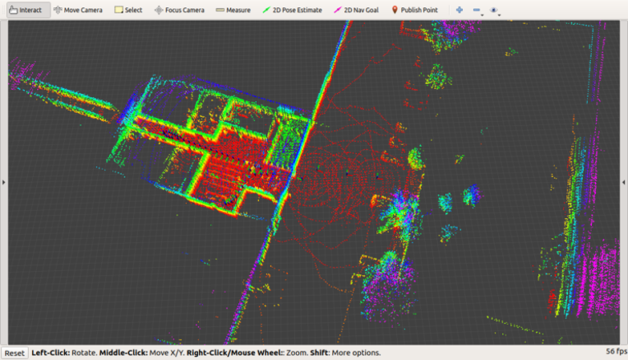
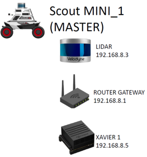
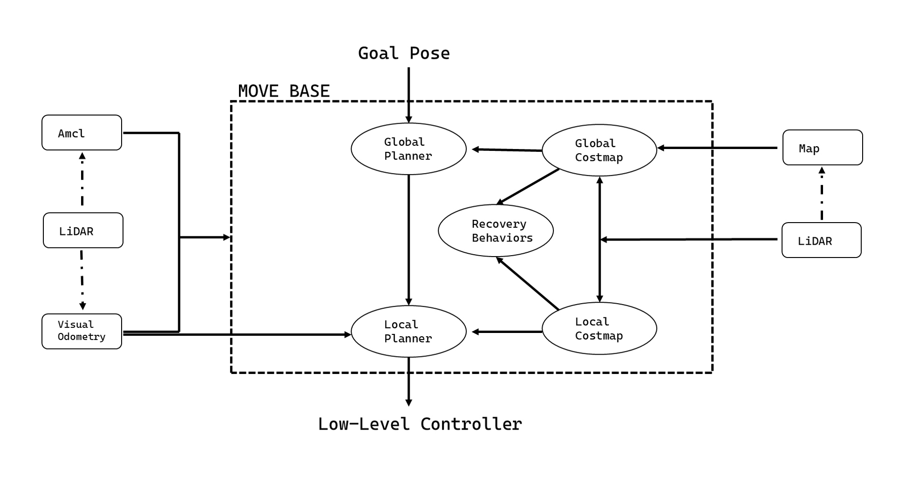
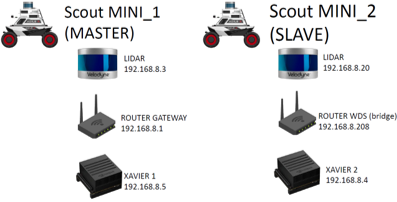
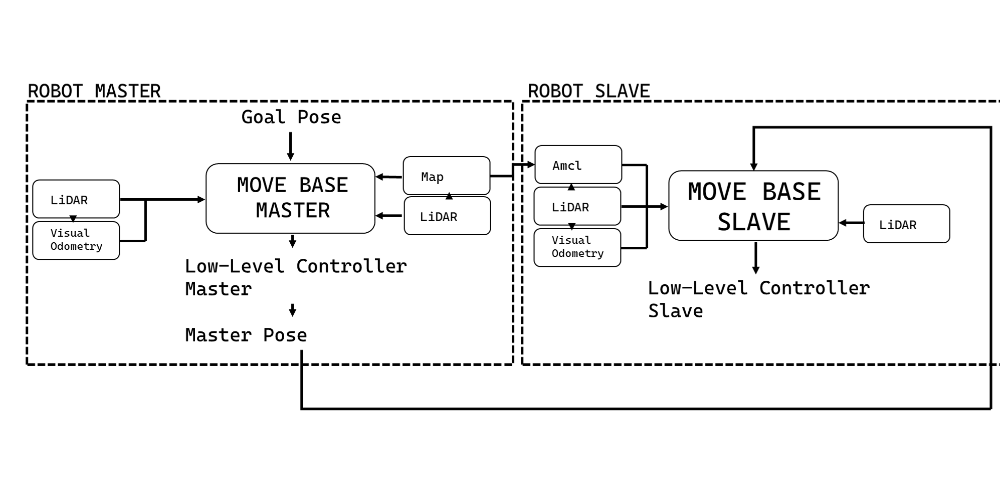

# Visiting Research – Autonomous Navigation  
### Li-SLAM & Swarm Master-Slave on AGILEX Scout Mini

> **Authors**  
> Pierangelo Malfi · Armando Nicolella  
> University of Naples “Federico II” · University of Udine  
> October – November 2023  

## 🚀  Project goal  
During a visiting period at UniUD we designed and field-tested a LiDAR-only autonomous-navigation pipeline aimed at coordinating multiple **AGILEX Scout Mini** robots. Key elements:

* Real-time odometry pose estimation with **Direct LiDAR Odometry** (DLO)
* 2-D mapping via **GMapping** with and without pre-recorded map
* **AMCL** for localization
* **Move Base** for global & local path-planning
* **Master-Slave Multi-Agent**: the master builds the map and streams way-points; the slave localises with AMCL into the master's map and follows them

Figure 1 – RViz screenshot: 3-D map stitched in real time by DLO.

## 🛠️  Hardware 
* **Robot:** AGILEX Scout Mini with CAN/USB interface  
* **Sensor:** Velodyne VLP-16 (16-beam LiDAR)  
* **Onboard Compute:** NVIDIA Jetson Xavier AGX (CUDA 11)  
* **Networking:** on-board Wi-Fi routers; single LAN for multi-robot (master acts as AP, slave as client)

## 🧩  Logical architecture
LiDAR → DLO → {  (1) GMapping → /map
                  (2) pre-map + AMCL → /map } → Move Base → cmd_vel

* **Single robot:** choose (1) live map or (2) saved map with AMCL drift correction.  
* **Multi-robot:** master runs (1); slave receives the shared map, localises with AMCL and tracks the master’s way-points.

### 🧍‍♂️ Single-Agent Setup – Hardware Architecture

*Figure 4 – Hardware layout for single robot setup: Scout Mini with Velodyne LiDAR, Xavier AGX, and router acting as ROS master.*

### 🧍‍♂️ Single-Agent – ROS Architecture

*Figure 5 – ROS-based software stack for single agent: DLO for pose, GMapping or AMCL for localisation, and Move Base for planning.*

### 🤖🤖 Multi-Agent Setup – Hardware Architecture

*Figure 6 – Two Scout Minis connected via Wi-Fi. Master robot builds the map; slave receives and uses it via AMCL.*

### 🤖🤖 Multi-Agent – ROS Architecture

*Figure 7 – ROS topics and data flow between Master and Slave. The bridge node handles waypoint sharing over Wi-Fi.*

## 📊  Results & open issues
* **Accuracy:** DLO + AMCL < 5 cm on 20 m indoor loop.  
* **Drift:** without AMCL, visible (> 0.5 m) after ~10 min continuous run.  
* **Swarm:** slave localisation still sensitive to sharp turns; considering map-merge (`multirobot_map_merge`) for extra robustness.

### Single Robot Autonomous Navigation

*Figure 2 – Indoor autonomous navigation using Direct LiDAR Odometry, GMapping and Move Base.*  
*Full `.mov` video available on request.*

### Multi-Agent Swarm – Master-Slave Architecture

*Figure 3 – Master robot shares map and way-points; slave robot localises via AMCL and follows.*  
*Full `.mov` video available on request.*

## 🔭  Next steps
* Cross-calibration of maps between robots  
* Heuristic multi-robot map-merge  
* Integrate IMU in DLO loop to cut residual drift  
* Outdoor field trials

## 🙏  Acknowledgements
* Mechatronics and Robotics Lab, University of Udine, for workspace and support  
* Diego Tiozzo Fasiolo for his help  
