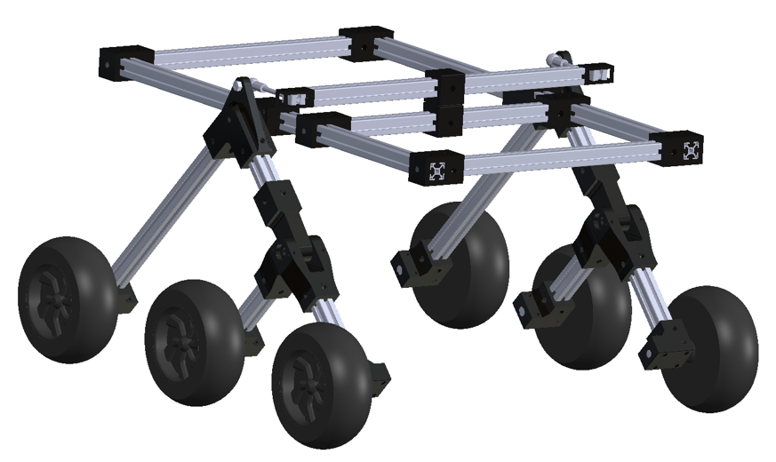
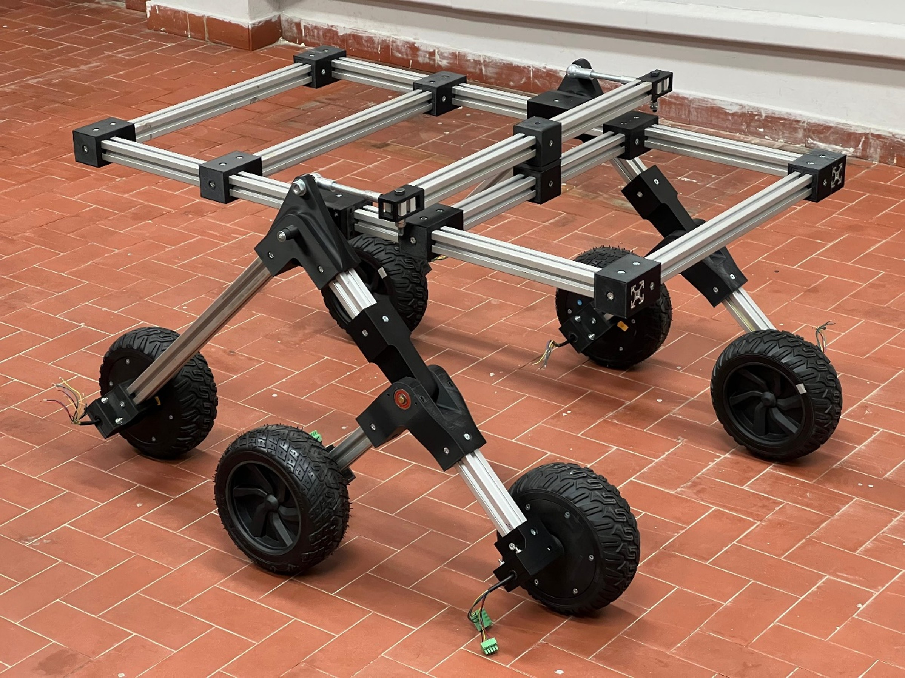
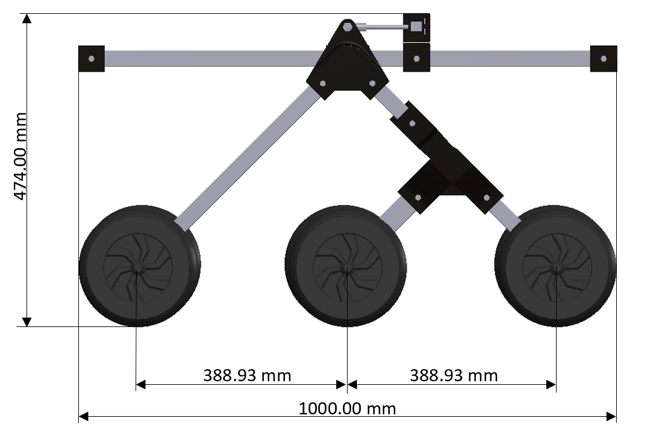
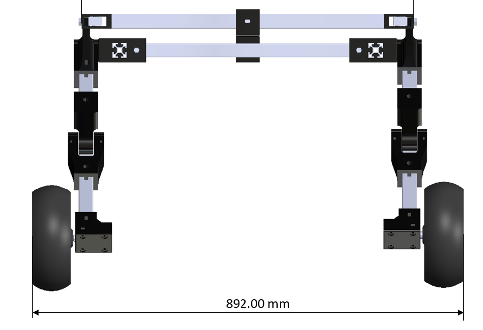
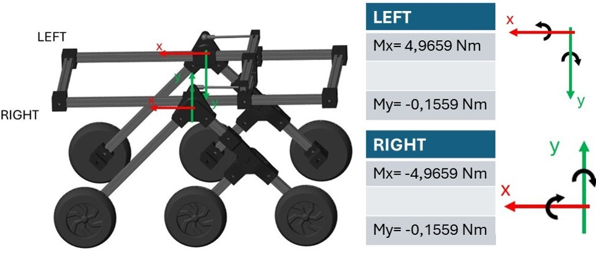
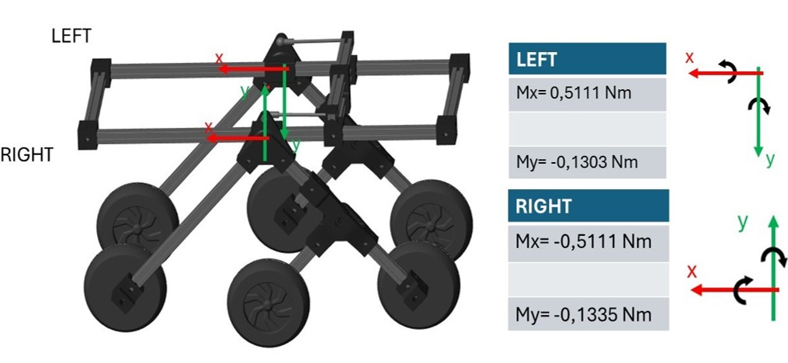

# 🚀 Full-Scale Rover Prototype

This section presents the development and structure of the **full-scale rocker-bogie rover**, designed to validate kinematic behaviors, mechanical stability, and terrain-interaction capabilities at real-world dimensions. It follows the initial proof-of-concept developed with the small-scale rover.

---
## 🖼️ From CAD to Reality

  
  &nbsp;&nbsp;&nbsp;
  

  
    <strong>Left:</strong> Physical full-scale prototype built using aluminum profiles and 3D printed joints  
    <strong>Right:</strong> Final CAD configuration before assembly
  

## 📐 Mechanical Architecture

  
  &nbsp;&nbsp;&nbsp;
  

  
    Dimensioned views of the full-scale rover:  
    <strong>Left:</strong> Side profile • <strong>Right:</strong> Frontal span
  

- Frame: T-slot aluminum profiles (30×30 mm)
- Joints: Custom-designed PLA/ABS parts
- Wheelbase: 1000 mm
- Width (outer wheel-to-wheel): 892 mm
- Overall height: ~474 mm
- Total mass (unloaded): 64 kg 
- Passive rocker-bogie suspension
- Motor mounts and sensors still under integration

## ⚙️ Motor & Driver Specs

The full-scale rover uses brushless DC motors controlled by **Stepdriver DBLS‑01S** motor drivers, capable of PID regulation. Below are the key specs:

### 🔌 Electrical & Mechanical Parameters

| Parameter               | Value                  |
|------------------------|------------------------|
| DC Supply Voltage      | 36 V                   |
| Continuous Current     | 8.3 A                  |
| Peak Current (3 s)     | 13 A                   |
| Max Motor Power        | 350 W                  |
| Driver Output Power    | 200 W                  |
| Gear Ratio             | 10 : 1                 |
| No-Load Speed          | 5000 rpm               |
| Stall Torque           | 0.8 N·m                |
| PID Gains              | Kₚ = 20, Kᵢ = 10       |

🔋 Drivers support multiple input voltages (24 V, 36 V, 48 V), with reduced current draw as voltage increases.  
In this configuration, the system runs at 36 V DC.

## 🛠️ Configuration Comparison

During the construction process, two different wheel configurations were considered:

- **Configuration A** – Inline mounting of all wheel arms
- **Configuration B** – Alternating layout (inner–outer–inner)

  
  &nbsp;&nbsp;&nbsp;
  

  
    <strong>Left:</strong> Initial configuration with aligned wheel supports  
    <strong>Right:</strong> Improved alternating layout (inner–outer–inner)
  

## 📍 Notes

- The structure has been dimensioned to accommodate onboard sensors, motor drivers, and computing units.  
- Cable routing and protection channels are integrated along the frame.

---

## 📄 Acknowledgments
The full-scale prototype was developed at the **LAM4R – Laboratory of Applied Mechanics for Robotics**, Department of Industrial Engineering, University of Naples Federico II.
Special thanks to **Pierangelo Malfi** and **Prof. Sergio Savino** for their contribuition throughout the design and mechanical realization stages.
This material is shared for non-commercial and academic demonstration purposes only. All rights and intellectual property belong to the University of Naples Federico II – Department of Industrial Engineering.
