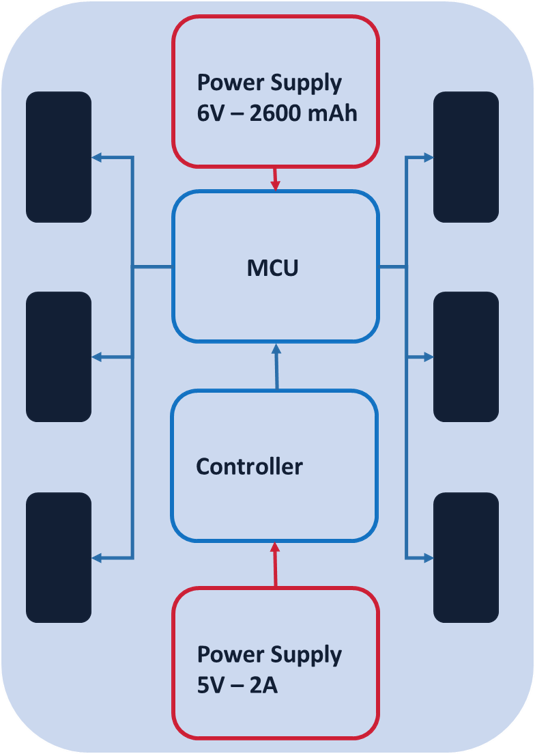
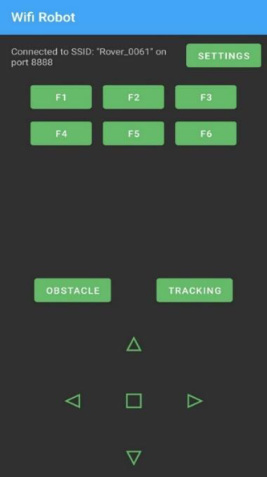
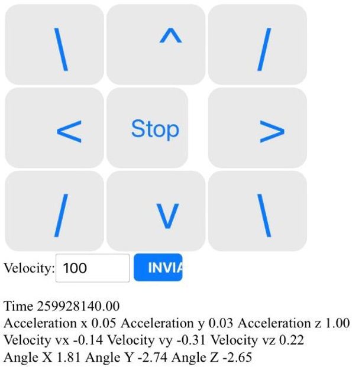
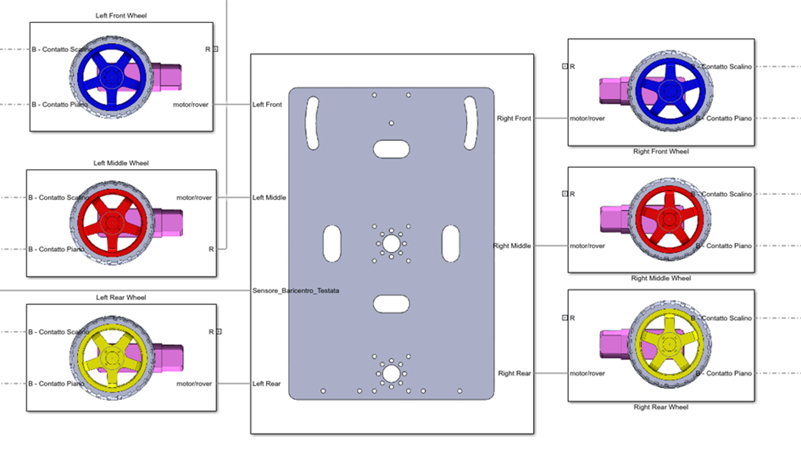
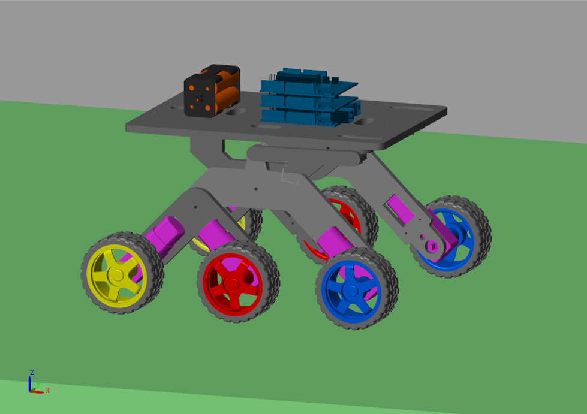
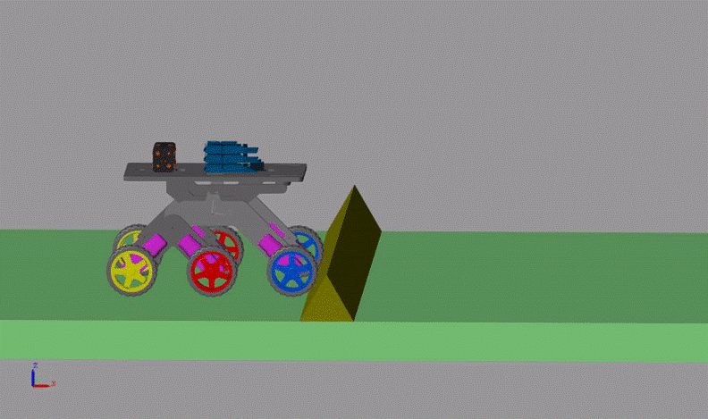
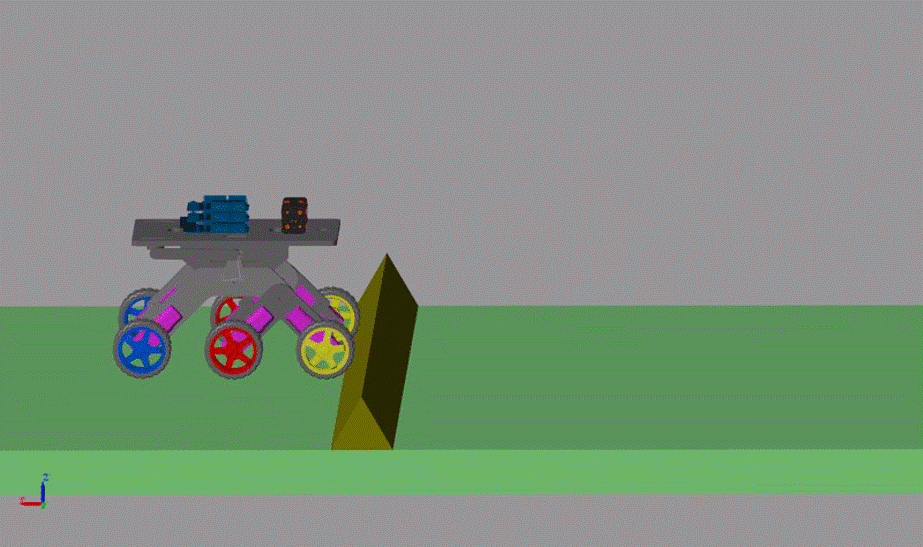

# 🛠️ Small‑Scale Rover Prototype – Demo Clips
Early experiments carried out on a rocker‑bogie rover, 3D‑printed in PLA and driven by 12 V gearmotors.  The platform was used to validate the multibody simulation model and basic control logic before committing to the full‑size build.

<!---->

  
  &nbsp;&nbsp;&nbsp;
  

  
    <strong>Left:</strong> Physical prototype • <strong>Right:</strong> System architecture overview
  

## 🔧 Hardware setup
| Component | Spec | 
|-----------|-----------|
| Dimensions (L × W × H)   | 272 × 251 × 150 mm (10.7 × 9.9 × 5.9 in)   | 
| Ground clearance   | ≈ 127 mm (5 in)   | 
| Wheel diameter   | 65 mm (2.55 in) rubber press‑fit wheels   | 
| Weight (unloaded)   | 0.58 kg (1.27 lb)   | 
| Motors   | 6 × DC gearmotors, 140 RPM @ 4.5–6 V; stall current 250 mA; stall torque 0.78 N·m   | 
| Suspension   | Passive rocker‑bogie, ABS chassis with snap‑fit joints   | 
| Power | 6.0 – 7.4 V battery pack|
| Micro‑controller | Arduino Uno WiFi Rev 2 |
| Motor driver | Adafruit Motor Shield v2 (I²C, dual TB6612) |

## Test environment   
All experiments on the small‑scale prototype were carried out **indoors** at the **LAM4R – Laboratory of Applied Mechanics for Robotics**, Department of Industrial Engineering, University of Naples Federico II.

## 💻 Software setup for experimental setup
| Layer / Tool | Details |
|--------------|---------|
| **Firmware** | Developed in the **Arduino IDE** (C++), using the official **Adafruit Motor Shield v2** library for TB6612 drivers. |
| **On‑board networking** | Arduino Uno WiFi Rev 2 hosts a lightweight **HTTP (TCP/IP) web server** for status pages and basic control. |
| **Tele‑operation app** | Remote driving also supported via an existing Android app that sends **UDP datagrams** (joystick + button commands) over the same WLAN. |
| **Communication ports** | I²C between Arduino and Motor Shield; Wi‑Fi 802.11 b/g/n for both TCP and UDP links. |

  
  &nbsp;&nbsp;&nbsp; <!-- space in the pics -->
  

  
    <strong>Left:</strong> <em>Osoyoo Wi‑Fi Robot App</em> – GUI © Osoyoo, all rights reserved. &nbsp;&nbsp;
    <strong>Right:</strong> In‑house web interface used during indoor tests.
  

## 🖥️ Simulation model

  
  

  
    Multiphysics environment: <strong>MATLAB Simscape Multibody</strong>.
  

## 🧪 Simulation Tests

1. **Straightforward motion**
   
  
 
  Simulation of the rover moving over flat terrain with passive suspension 
    dynamics.  

2. **Obstacle interaction**
   
  &nbsp;&nbsp;&nbsp;  
 
 
    Comparison of obstacle-crossing performance under identical initial conditions. <strong>Left:</strong> Side view • <strong>Right:</strong> Front view  

## 📄 Copyright & Acknowledgments
This material is shared for non-commercial and academic demonstration purposes only. All rights and intellectual property belong to the University of Naples Federico II – Department of Industrial Engineering.  
Special thanks to Pierangelo Malfi for his significant contributions throughout the development of this project.
We also extend our gratitude to the master's thesis students who collaborated on various aspects of the prototype's design and testing.

